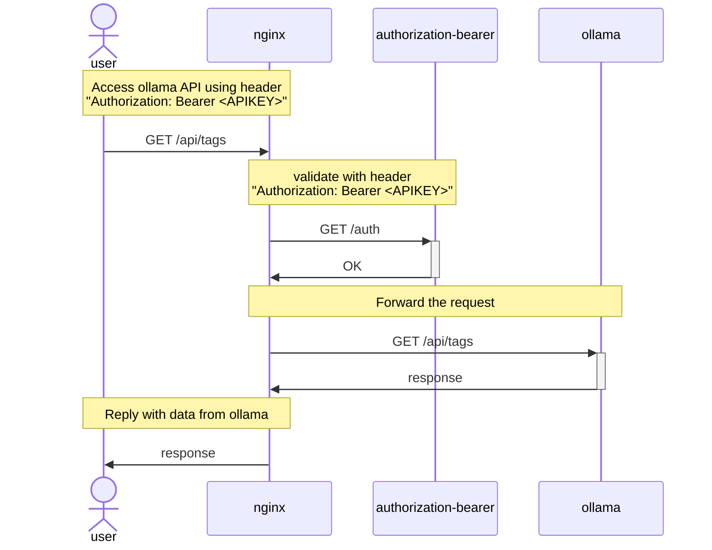

# Custom docker image to run `ollama` behind authentication proxy

Image for amd64/arm64 available at [docker hub](https://hub.docker.com/repository/docker/brilliantcreator/ollama-authentication-proxy).

Based on the original [ollama](https://hub.docker.com/r/ollama/ollama) docker image.

Using custom tool `authorization-bearer` to authenticate incoming requests
for `ollama` via a `nginx` reverse-proxy hook.

Requests must provide header `Authorization: Bearer <APIKEY>` to access the `ollama` API.

Multiple API-Keys can be provided via environment variables like
- AUTHORIZATION_APIKEY=foo
- AUTHORIZATION_APIKEY_1=hello-world
- AUTHORIZATION_APIKEY_2=my-private-api-key

The container will use the following ports:
- 18434: Nginx reverse-proxy to provide authenticated endpoints for ollama
- 8080: Tool `authorization-bearer` to validate authorization
- 11434: Ollama

